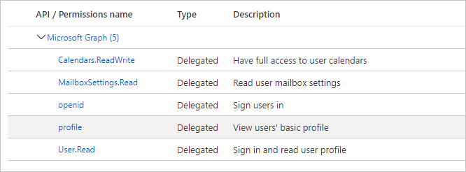

<!-- markdownlint-disable MD002 MD041 -->

In dieser Übung erstellen Sie eine neue bot-Kanal Registrierung und eine Azure AD-Webanwendungs Registrierung mithilfe des Azure-Portals.In this exercise, you will create a new Bot Channels registration and an Azure AD web application registration using the Azure Portal.

## Erstellen einer bot-Kanal RegistrierungCreate a Bot Channels registration

1. Öffnen Sie einen Browser, und navigieren Sie zum [Azure-Portal](https://portal.azure.com).Open a browser and navigate to the [Azure Portal](https://portal.azure.com). Melden Sie sich mit dem Konto an, das Ihrem Azure-Abonnement zugeordnet ist.Login using the account associated with your Azure subscription.

1. Wählen Sie das obere linke Menü aus, und wählen Sie dann **Ressource erstellen** aus.Select the upper-left menu, then select **Create a resource**.

    

1. Suchen Sie auf der **neuen** Seite nach der `Bot Channel` Registrierung von **bot Kanälen**, und wählen Sie Sie aus.On the **New** page, search for `Bot Channel` and select **Bot Channels Registration**.

1. Wählen Sie auf der Seite **bot-Kanal Registrierung** die Option **Create** aus.On the **Bot Channels Registration** page, select **Create**.

1. Füllen Sie die erforderlichen Felder aus, und lassen Sie den **Messaging-Endpunkt** leer.Fill in the required fields, and leave **Messaging endpoint** blank. Das Feld **bot-handle** muss eindeutig sein.The **Bot handle** field must be unique. Überprüfen Sie unbedingt die verschiedenen Preiskategorien, und wählen Sie aus, was für Ihr Szenario sinnvoll ist.Be sure to review the different pricing tiers and select what makes sense for your scenario. Wenn es sich nur um eine Lern Übung handelt, können Sie die Option kostenlos auswählen.If this is just a learning exercise, you may want to select the free option.

1. Wählen Sie die **Microsoft App-ID und das Kennwort** aus, und wählen Sie dann **neu erstellen** aus.Select the **Microsoft App ID and password**, then select **Create New**.

1. Wählen Sie **im App-Registrierungs Portal die Option APP-ID erstellen aus**.Select **Create App ID in the App Registration Portal**. Dadurch wird ein neues Fenster oder eine neue Registerkarte für das Blade " **App-Registrierungen** " im Azure-Portal geöffnet.This will open a new window or tab to the **App registrations** blade in the Azure Portal.

1. Wählen Sie im Blatt **App-Registrierungen** die Option **neue Registrierung** aus.In the **App registrations** blade, select **New registration**.

1. Legen Sie die Werte wie folgt fest.Set the values as follows.

    - Legen Sie **Name** auf `Graph Calendar Bot` fest.Set **Name** to `Graph Calendar Bot`.
    - Legen Sie **Unterstützte Kontotypen** auf **Konten in allen Organisationsverzeichnissen und persönliche Microsoft-Konten** fest.Set **Supported account types** to **Accounts in any organizational directory and personal Microsoft accounts**.
    - Lassen Sie **URI umleiten** leer.Leave **Redirect URI** empty.

    

1. Wählen Sie **Registrieren** aus.Select **Register**. Kopieren Sie auf der Seite **Diagramm Kalender-bot** den Wert der **Anwendungs-ID (Client)** , und speichern Sie ihn, benötigen Sie ihn in den folgenden Schritten.On the **Graph Calendar Bot** page, copy the value of the **Application (client) ID** and save it, you will need it in the following steps.

    

1. Wählen Sie unter **Verwalten** die Option **Zertifikate und Geheime Clientschlüssel** aus.Select **Certificates & secrets** under **Manage**. Wählen Sie die Schaltfläche **Neuen geheimen Clientschlüssel** aus.Select the **New client secret** button. Geben Sie einen Wert in **Beschreibung** ein, wählen Sie eine der Optionen für **Gilt bis** aus, und wählen Sie dann **Hinzufügen** aus.Enter a value in **Description** and select one of the options for **Expires** and select **Add**.

1. Kopieren Sie den Wert des geheimen Clientschlüssels, bevor Sie diese Seite verlassen.Copy the client secret value before you leave this page. Sie benötigen Sie in den folgenden Schritten.You will need it in the following steps.

    > [!IMPORTANT]
    > Dieser geheime Clientschlüssel wird nicht noch einmal angezeigt, stellen Sie daher sicher, dass Sie ihn jetzt kopieren.This client secret is never shown again, so make sure you copy it now. Sie müssen diesen Wert an mehreren Stellen eingeben, damit Sie ihn sicher halten können.You will need to enter this value in multiple places so keep it safe.

1. Kehren Sie zum Fenster bot-Kanal Registrierung in Ihrem Browser zurück, und fügen Sie die Anwendungs-ID in das Feld **Microsoft App-ID** ein.Return to the Bot Channel Registration window in your browser, and paste the application ID into the **Microsoft App ID** field. Fügen Sie den geheimen Client Schlüssel in das Feld **Password ein** .Paste your client secret into the **Password** field. Wählen Sie **OK** aus.Select **OK**.

1. Wählen Sie auf der Seite **Bots-Kanal Registrierung** die Option **Create** aus.On the **Bots Channels Registration** page, select **Create**.

1. Warten Sie, bis die bot-Kanal Registrierung erstellt wurde.Wait for the Bot Channels registration to be created. Kehren Sie nach der Erstellung zur Startseite im Azure-Portal zurück, und wählen Sie dann **bot-Dienste** aus.Once created, return to the Home page in the Azure Portal, then select **Bot Services**. Wählen Sie Ihre neue Bots-Kanal Registrierung aus, um die Eigenschaften anzuzeigen.Select your new Bots Channel registration to view its properties.

## Erstellen einer webapp-RegistrierungCreate a web app registration

1. Kehren Sie zum Abschnitt **App-Registrierungen** des Azure-Portals zurück.Return to the **App registrations** section of the Azure Portal.

1. Wählen Sie **Neue Registrierung** aus.Select **New registration**. Legen Sie auf der Seite **Anwendung registrieren** die Werte wie folgt fest.On the **Register an application** page, set the values as follows.

    - Legen Sie **Name** auf `Graph Calendar Bot Auth` fest.Set **Name** to `Graph Calendar Bot Auth`.
    - Legen Sie **Unterstützte Kontotypen** auf **Konten in allen Organisationsverzeichnissen und persönliche Microsoft-Konten** fest.Set **Supported account types** to **Accounts in any organizational directory and personal Microsoft accounts**.
    - Legen Sie unter **Umleitungs-URI** die erste Dropdownoption auf `Web` fest, und legen Sie den Wert auf `https://token.botframework.com/.auth/web/redirect` fest.Under **Redirect URI**, set the first drop-down to `Web` and set the value to `https://token.botframework.com/.auth/web/redirect`.

1. Wählen Sie **Registrieren** aus.Select **Register**. Kopieren Sie auf der Seite **Diagramm Kalender-bot-Authentifizierung** den Wert der **Anwendungs-ID (Client)** , und speichern Sie ihn, benötigen Sie ihn in den folgenden Schritten.On the **Graph Calendar Bot Auth** page, copy the value of the **Application (client) ID** and save it, you will need it in the following steps.

1. Wählen Sie unter **Verwalten** die Option **Zertifikate und Geheime Clientschlüssel** aus.Select **Certificates & secrets** under **Manage**. Wählen Sie die Schaltfläche **Neuen geheimen Clientschlüssel** aus.Select the **New client secret** button. Geben Sie einen Wert in **Beschreibung** ein, wählen Sie eine der Optionen für **Gilt bis** aus, und wählen Sie dann **Hinzufügen** aus.Enter a value in **Description** and select one of the options for **Expires** and select **Add**.

1. Kopieren Sie den Wert des geheimen Clientschlüssels, bevor Sie diese Seite verlassen.Copy the client secret value before you leave this page. Sie benötigen Sie in den folgenden Schritten.You will need it in the following steps.

1. Wählen Sie **API-Berechtigungen** aus, und wählen Sie dann **Berechtigung hinzufügen** aus.Select **API permissions**, then select **Add a permission**.

1. Wählen Sie **Microsoft Graph** aus, und wählen Sie dann **Delegierte Berechtigungen** aus.Select **Microsoft Graph**, then select **Delegated permissions**.

1. Wählen Sie die folgenden Berechtigungen aus, und wählen Sie dann **Berechtigungen hinzufügen** aus.Select the following permissions, then select **Add permissions**.

    - **openid****openid**
    - **Profil****profile**
    - **Calendars.ReadWrite****Calendars.ReadWrite**
    - **MailboxSettings.Read****MailboxSettings.Read**

    

### Informationen zu BerechtigungenAbout permissions

Stellen Sie sich vor, was jeder dieser Berechtigungs Bereiche dem bot erlaubt und wofür der bot ihn verwendet.Consider what each of those permission scopes allows the bot to do, and what the bot will use them for.

- **OpenID** und **Profil**: ermöglicht dem bot, Benutzer zu signieren und grundlegende Informationen aus Azure AD im Identitätstoken abzurufen.**openid** and **profile**: allows the bot to sign users in and get basic information from Azure AD in the identity token.
- Calendars **. ReadWrite**: ermöglicht dem bot, den Kalender des Benutzers zu lesen und dem Kalender des Benutzers neue Ereignisse hinzuzufügen.**Calendars.ReadWrite**: allows the bot to read the user's calendar and to add new events to the user's calendar.
- **Mailbox Settings. Read**: ermöglicht dem bot, die Postfacheinstellungen des Benutzers zu lesen.**MailboxSettings.Read**: allows the bot to read the user's mailbox settings. Der Bot wird dies verwenden, um die ausgewählte Zeitzone des Benutzers abzurufen.The bot will use this to get the user's selected time zone.
- **User. Read**: ermöglicht dem bot, das Profil des Benutzers aus Microsoft Graph abzurufen.**User.Read**: allows the bot to get the user's profile from Microsoft Graph. Der Bot wird dies verwenden, um den Namen des Benutzers abzurufen.The bot will use this to get the user's name.

## OAuth-Verbindung zum bot hinzufügenAdd OAuth connection to the bot

1. Navigieren Sie zur Registrierungsseite für bot-Kanäle Ihres bot im Azure-Portal.Navigate to your bot's Bot Channels Registration page on the Azure Portal. Wählen Sie unter **bot-Verwaltung** **Einstellungen** aus.Select **Settings** under **Bot Management**.

1. Wählen Sie unter **OAuth-Verbindungseinstellungen** am unteren Rand der Seite die Option **Einstellung hinzufügen** aus.Under **OAuth Connection Settings** near the bottom of the page, select **Add Setting**.

1. Füllen Sie das Formular wie folgt aus, und wählen Sie dann **Speichern** aus.Fill in the form as follows, then select **Save**.

    - **Name**: `GraphBotAuth`**Name**: `GraphBotAuth`
    - **Anbieter**: **Azure Active Directory v2****Provider**: **Azure Active Directory v2**
    - **Client-ID**: die Anwendungs-ID Ihrer **Graph-Kalender-bot-Authentifizierungs** Registrierung.**Client id**: The application ID of your **Graph Calendar Bot Auth** registration.
    - **Geheimer Client Schlüssel**: der geheime Client Schlüssel Ihrer **Graph Calendar bot auth** -Registrierung.**Client secret**: The client secret of your **Graph Calendar Bot Auth** registration.
    - **Token Exchange-URL**: leer lassen**Token Exchange URL**: Leave blank
    - **Mandanten-ID**: `common`**Tenant ID**: `common`
    - **Bereiche**: `openid profile Calendars.ReadWrite MailboxSettings.Read User.Read`**Scopes**: `openid profile Calendars.ReadWrite MailboxSettings.Read User.Read`

1. Wählen Sie den **GraphBotAuth** -Eintrag unter **OAuth Connection Settings** aus.Select the **GraphBotAuth** entry under **OAuth Connection Settings**.

1. Wählen Sie **Verbindung testen** aus.Select **Test Connection**. Dadurch wird ein neues Browserfenster oder eine neue Registerkarte geöffnet, um den OAuth-Fluss zu starten.This opens a new browser window or tab to start the OAuth flow.

1. Melden Sie sich bei Bedarf an.If necessary, sign in. Überprüfen Sie die Liste der angeforderten Berechtigungen, und wählen Sie dann **akzeptieren** aus.Review the list of requested permissions, then select **Accept**.

1. Es sollte eine **Test Verbindung mit der erfolgreichen Nachricht "GraphBotAuth" angezeigt werden** .You should see a **Test Connection to 'GraphBotAuth' Succeeded** message.

> [!TIP]
> Sie können auf dieser Seite die Schaltfläche " **Token kopieren** " auswählen und das Token in einfügen, [https://jwt.ms](https://jwt.ms) um die Ansprüche innerhalb des Tokens anzuzeigen.You can select the **Copy Token** button on this page, and paste the token into [https://jwt.ms](https://jwt.ms) to see the claims inside the token. Dies ist hilfreich bei der Behandlung von Authentifizierungsfehlern.This is useful when troubleshooting authentication errors.
