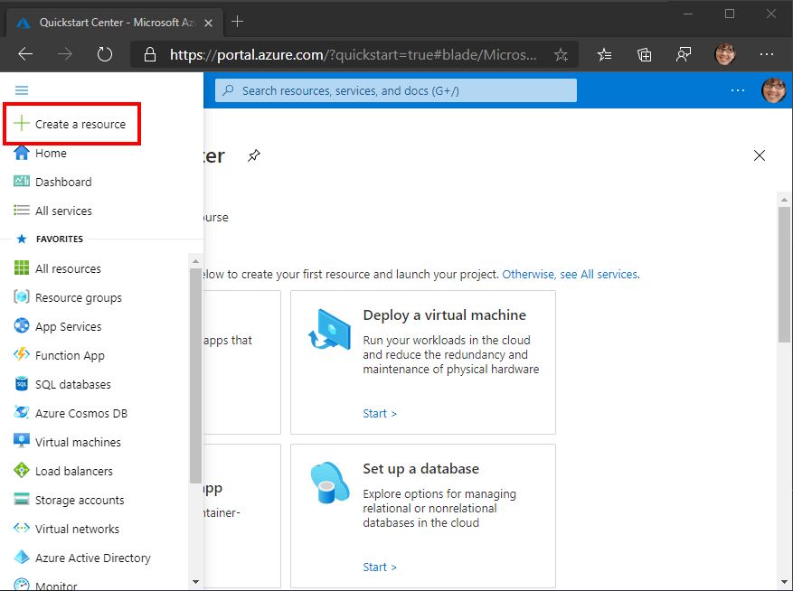

<!-- markdownlint-disable MD002 MD041 -->

In dieser Übung erstellen Sie eine neue bot-Kanal Registrierung und eine Azure AD-Webanwendungs Registrierung mithilfe des Azure-Portals.

## Erstellen einer bot-Kanal Registrierung

1. Öffnen Sie einen Browser, und navigieren Sie zum [Azure-Portal](https://portal.azure.com). Melden Sie sich mit dem Konto an, das Ihrem Azure-Abonnement zugeordnet ist.

1. Wählen Sie das obere linke Menü aus, und wählen Sie dann **Ressource erstellen** aus.

    

1. Suchen Sie auf der **neuen** Seite nach der `Bot Channel` Registrierung von **bot Kanälen**, und wählen Sie Sie aus.

1. Wählen Sie auf der Seite **bot-Kanal Registrierung** die Option **Create** aus.

1. Füllen Sie die erforderlichen Felder aus, und lassen Sie den **Messaging-Endpunkt** leer. Das Feld **bot-handle** muss eindeutig sein. Überprüfen Sie unbedingt die verschiedenen Preiskategorien, und wählen Sie aus, was für Ihr Szenario sinnvoll ist. Wenn es sich nur um eine Lern Übung handelt, können Sie die Option kostenlos auswählen.

1. Wählen Sie die **Microsoft App-ID und das Kennwort** aus, und wählen Sie dann **neu erstellen** aus.

1. Wählen Sie **im App-Registrierungs Portal die Option APP-ID erstellen aus**. Dadurch wird ein neues Fenster oder eine neue Registerkarte für das Blade " **App-Registrierungen** " im Azure-Portal geöffnet.

1. Wählen Sie im Blatt **App-Registrierungen** die Option **neue Registrierung** aus.

1. Legen Sie die Werte wie folgt fest.

    - Legen Sie **Name** auf `Graph Calendar Bot` fest.
    - Legen Sie **Unterstützte Kontotypen** auf **Konten in allen Organisationsverzeichnissen und persönliche Microsoft-Konten** fest.
    - Lassen Sie **URI umleiten** leer.

    

1. Wählen Sie **Registrieren** aus. Kopieren Sie auf der Seite **Diagramm Kalender-bot** den Wert der **Anwendungs-ID (Client)** , und speichern Sie ihn, benötigen Sie ihn in den folgenden Schritten.

    

1. Wählen Sie unter **Verwalten** die Option **Zertifikate und Geheime Clientschlüssel** aus. Wählen Sie die Schaltfläche **Neuen geheimen Clientschlüssel** aus. Geben Sie einen Wert in **Beschreibung** ein, wählen Sie eine der Optionen für **Gilt bis** aus, und wählen Sie dann **Hinzufügen** aus.

1. Kopieren Sie den Wert des geheimen Clientschlüssels, bevor Sie diese Seite verlassen. Sie benötigen Sie in den folgenden Schritten.

    > [!IMPORTANT]
    > Dieser geheime Clientschlüssel wird nicht noch einmal angezeigt, stellen Sie daher sicher, dass Sie ihn jetzt kopieren. Sie müssen diesen Wert an mehreren Stellen eingeben, damit Sie ihn sicher halten können.

1. Kehren Sie zum Fenster bot-Kanal Registrierung in Ihrem Browser zurück, und fügen Sie die Anwendungs-ID in das Feld **Microsoft App-ID** ein. Fügen Sie den geheimen Client Schlüssel in das Feld **Password ein** . Wählen Sie **OK** aus.

1. Wählen Sie auf der Seite **Bots-Kanal Registrierung** die Option **Create** aus.

1. Warten Sie, bis die bot-Kanal Registrierung erstellt wurde. Kehren Sie nach der Erstellung zur Startseite im Azure-Portal zurück, und wählen Sie dann **bot-Dienste** aus. Wählen Sie Ihre neue Bots-Kanal Registrierung aus, um die Eigenschaften anzuzeigen.

## Erstellen einer webapp-Registrierung

1. Kehren Sie zum Abschnitt **App-Registrierungen** des Azure-Portals zurück.

1. Wählen Sie **Neue Registrierung** aus. Legen Sie auf der Seite **Anwendung registrieren** die Werte wie folgt fest.

    - Legen Sie **Name** auf `Graph Calendar Bot Auth` fest.
    - Legen Sie **Unterstützte Kontotypen** auf **Konten in allen Organisationsverzeichnissen und persönliche Microsoft-Konten** fest.
    - Legen Sie unter **Umleitungs-URI** die erste Dropdownoption auf `Web` fest, und legen Sie den Wert auf `https://token.botframework.com/.auth/web/redirect` fest.

1. Wählen Sie **Registrieren** aus. Kopieren Sie auf der Seite **Diagramm Kalender-bot-Authentifizierung** den Wert der **Anwendungs-ID (Client)** , und speichern Sie ihn, benötigen Sie ihn in den folgenden Schritten.

1. Wählen Sie unter **Verwalten** die Option **Zertifikate und Geheime Clientschlüssel** aus. Wählen Sie die Schaltfläche **Neuen geheimen Clientschlüssel** aus. Geben Sie einen Wert in **Beschreibung** ein, wählen Sie eine der Optionen für **Gilt bis** aus, und wählen Sie dann **Hinzufügen** aus.

1. Kopieren Sie den Wert des geheimen Clientschlüssels, bevor Sie diese Seite verlassen. Sie benötigen Sie in den folgenden Schritten.

1. Wählen Sie **API-Berechtigungen** aus, und wählen Sie dann **Berechtigung hinzufügen** aus.

1. Wählen Sie **Microsoft Graph** aus, und wählen Sie dann **Delegierte Berechtigungen** aus.

1. Wählen Sie die folgenden Berechtigungen aus, und wählen Sie dann **Berechtigungen hinzufügen** aus.

    - **openid**
    - **Profil**
    - **Calendars.ReadWrite**
    - **MailboxSettings.Read**

    

### Informationen zu Berechtigungen

Stellen Sie sich vor, was jeder dieser Berechtigungs Bereiche dem bot erlaubt und wofür der bot ihn verwendet.

- **OpenID** und **Profil**: ermöglicht dem bot, Benutzer zu signieren und grundlegende Informationen aus Azure AD im Identitätstoken abzurufen.
- Calendars **. ReadWrite**: ermöglicht dem bot, den Kalender des Benutzers zu lesen und dem Kalender des Benutzers neue Ereignisse hinzuzufügen.
- **Mailbox Settings. Read**: ermöglicht dem bot, die Postfacheinstellungen des Benutzers zu lesen. Der Bot wird dies verwenden, um die ausgewählte Zeitzone des Benutzers abzurufen.
- **User. Read**: ermöglicht dem bot, das Profil des Benutzers aus Microsoft Graph abzurufen. Der Bot wird dies verwenden, um den Namen des Benutzers abzurufen.

## OAuth-Verbindung zum bot hinzufügen

1. Navigieren Sie zur Registrierungsseite für bot-Kanäle Ihres bot im Azure-Portal. Wählen Sie unter **bot-Verwaltung** **Einstellungen** aus.

1. Wählen Sie unter **OAuth-Verbindungseinstellungen** am unteren Rand der Seite die Option **Einstellung hinzufügen** aus.

1. Füllen Sie das Formular wie folgt aus, und wählen Sie dann **Speichern** aus.

    - **Name**: `GraphBotAuth`
    - **Anbieter**: **Azure Active Directory v2**
    - **Client-ID**: die Anwendungs-ID Ihrer **Graph-Kalender-bot-Authentifizierungs** Registrierung.
    - **Geheimer Client Schlüssel**: der geheime Client Schlüssel Ihrer **Graph Calendar bot auth** -Registrierung.
    - **Token Exchange-URL**: leer lassen
    - **Mandanten-ID**: `common`
    - **Bereiche**: `openid profile Calendars.ReadWrite MailboxSettings.Read User.Read`

1. Wählen Sie den **GraphBotAuth** -Eintrag unter **OAuth Connection Settings** aus.

1. Wählen Sie **Verbindung testen** aus. Dadurch wird ein neues Browserfenster oder eine neue Registerkarte geöffnet, um den OAuth-Fluss zu starten.

1. Melden Sie sich bei Bedarf an. Überprüfen Sie die Liste der angeforderten Berechtigungen, und wählen Sie dann **akzeptieren** aus.

1. Es sollte eine **Test Verbindung mit der erfolgreichen Nachricht "GraphBotAuth" angezeigt werden** .

> [!TIP]
> Sie können auf dieser Seite die Schaltfläche " **Token kopieren** " auswählen und das Token in einfügen, [https://jwt.ms](https://jwt.ms) um die Ansprüche innerhalb des Tokens anzuzeigen. Dies ist hilfreich bei der Behandlung von Authentifizierungsfehlern.
