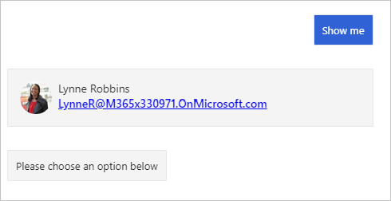

<!-- markdownlint-disable MD002 MD041 -->

<span data-ttu-id="bdaa4-101">In diesem Abschnitt verwenden Sie das Microsoft Graph-SDK, um den angemeldeten Benutzer abzurufen.</span><span class="sxs-lookup"><span data-stu-id="bdaa4-101">In this section you'll use the Microsoft Graph SDK to get the logged-in user.</span></span>

## <a name="create-a-graph-service"></a><span data-ttu-id="bdaa4-102">Erstellen eines Graph-Diensts</span><span class="sxs-lookup"><span data-stu-id="bdaa4-102">Create a Graph service</span></span>

<span data-ttu-id="bdaa4-103">Beginnen Sie mit der Implementierung eines Diensts, der vom bot verwendet werden kann, um ein **GraphServiceClient** aus dem Microsoft Graph-SDK zu erhalten und diesen Dienst dann für den bot über Dependency Injection verfügbar zu machen.</span><span class="sxs-lookup"><span data-stu-id="bdaa4-103">Start by implementing a service that the bot can use to get a **GraphServiceClient** from the Microsoft Graph SDK, then making that service available to the bot via dependency injection.</span></span>

1. <span data-ttu-id="bdaa4-104">Erstellen Sie ein neues Verzeichnis im Stamm des Projekts mit dem Namen **Graph**.</span><span class="sxs-lookup"><span data-stu-id="bdaa4-104">Create a new directory in the root of the project named **Graph**.</span></span> <span data-ttu-id="bdaa4-105">Erstellen Sie eine neue Datei im **./Graph** -Verzeichnis mit dem Namen **IGraphClientService.cs** , und fügen Sie den folgenden Code hinzu.</span><span class="sxs-lookup"><span data-stu-id="bdaa4-105">Create a new file in the **./Graph** directory named **IGraphClientService.cs** and add the following code.</span></span>

    :::code language="csharp" source="../demo/GraphCalendarBot/Graph/IGraphClientService.cs" id="IGraphClientServiceSnippet":::

1. <span data-ttu-id="bdaa4-106">Erstellen Sie eine neue Datei im **./Graph** -Verzeichnis mit dem Namen **GraphClientService.cs** , und fügen Sie den folgenden Code hinzu.</span><span class="sxs-lookup"><span data-stu-id="bdaa4-106">Create a new file in the **./Graph** directory named **GraphClientService.cs** and add the following code.</span></span>

    :::code language="csharp" source="../demo/GraphCalendarBot/Graph/GraphClientService.cs" id="GraphClientServiceSnippet":::

1. <span data-ttu-id="bdaa4-107">Öffnen Sie **./Startup.cs** , und fügen Sie den folgenden Code am Ende der `ConfigureServices` Funktion hinzu.</span><span class="sxs-lookup"><span data-stu-id="bdaa4-107">Open **./Startup.cs** and add the following code to the end of the `ConfigureServices` function.</span></span>

    :::code language="csharp" source="../demo/GraphCalendarBot/Startup.cs" id="AddGraphServiceSnippet":::

1. <span data-ttu-id="bdaa4-108">Öffnen Sie **./Dialogs/MainDialog.cs**.</span><span class="sxs-lookup"><span data-stu-id="bdaa4-108">Open **./Dialogs/MainDialog.cs**.</span></span> <span data-ttu-id="bdaa4-109">Fügen Sie am `using` Anfang der Datei die folgenden Anweisungen hinzu.</span><span class="sxs-lookup"><span data-stu-id="bdaa4-109">Add the following `using` statements to the top of the file.</span></span>

    ```csharp
    using System;
    using System.IO;
    using CalendarBot.Graph;
    using AdaptiveCards;
    using Microsoft.Graph;
    ```

1. <span data-ttu-id="bdaa4-110">Fügen Sie der **MainDialog** -Klasse die folgende Eigenschaft hinzu.</span><span class="sxs-lookup"><span data-stu-id="bdaa4-110">Add the following property to the **MainDialog** class.</span></span>

    ```csharp
    private readonly IGraphClientService _graphClientService;
    ```

1. <span data-ttu-id="bdaa4-111">Suchen Sie den Konstruktor für die **MainDialog** -Klasse, und aktualisieren Sie seine Signatur, um einen **IGraphServiceClient** -Parameter zu übernehmen.</span><span class="sxs-lookup"><span data-stu-id="bdaa4-111">Locate the constructor for the **MainDialog** class and update its signature to take an **IGraphServiceClient** parameter.</span></span>

    :::code language="csharp" source="../demo/GraphCalendarBot/Dialogs/MainDialog.cs" id="ConstructorSignatureSnippet" highlight="4":::

1. <span data-ttu-id="bdaa4-112">Fügen Sie den folgenden Code zum Konstruktor hinzu.</span><span class="sxs-lookup"><span data-stu-id="bdaa4-112">Add the following code to the constructor.</span></span>

    ```csharp
    _graphClientService = graphClientService;
    ```

## <a name="get-the-logged-on-user"></a><span data-ttu-id="bdaa4-113">Den angemeldeten Benutzer abrufen</span><span class="sxs-lookup"><span data-stu-id="bdaa4-113">Get the logged on user</span></span>

<span data-ttu-id="bdaa4-114">In diesem Abschnitt verwenden Sie Microsoft Graph, um den Namen, die e-Mail-Adresse und das Foto des Benutzers abzurufen.</span><span class="sxs-lookup"><span data-stu-id="bdaa4-114">In this section you'll use the Microsoft Graph to get the user's name, email address, and photo.</span></span> <span data-ttu-id="bdaa4-115">Anschließend erstellen Sie eine Adaptive Karte, um die Informationen anzuzeigen.</span><span class="sxs-lookup"><span data-stu-id="bdaa4-115">Then you'll create an Adaptive Card to show the information.</span></span>

1. <span data-ttu-id="bdaa4-116">Erstellen Sie eine neue Datei im Stamm des Projekts mit dem Namen **CardHelper.cs**.</span><span class="sxs-lookup"><span data-stu-id="bdaa4-116">Create a new file in the root of the project named **CardHelper.cs**.</span></span> <span data-ttu-id="bdaa4-117">Fügen Sie den folgenden Code in die Datei ein:</span><span class="sxs-lookup"><span data-stu-id="bdaa4-117">Add the following code to the file.</span></span>

    ```csharp
    using AdaptiveCards;
    using Microsoft.Graph;
    using System;
    using System.IO;

    namespace CalendarBot
    {
        public class CardHelper
        {
            public static AdaptiveCard GetUserCard(User user, Stream photo)
            {
              // Create an Adaptive Card to display the user
                // See https://adaptivecards.io/designer/ for possibilities
                var userCard = new AdaptiveCard("1.2");

                var columns = new AdaptiveColumnSet();
                userCard.Body.Add(columns);

                var userPhotoColumn = new AdaptiveColumn { Width = AdaptiveColumnWidth.Auto };
                columns.Columns.Add(userPhotoColumn);

                userPhotoColumn.Items.Add(new AdaptiveImage {
                    Style = AdaptiveImageStyle.Person,
                    Size = AdaptiveImageSize.Small,
                    Url = GetDataUriFromPhoto(photo)
                });

                var userInfoColumn = new AdaptiveColumn {Width = AdaptiveColumnWidth.Stretch };
                columns.Columns.Add(userInfoColumn);

                userInfoColumn.Items.Add(new AdaptiveTextBlock {
                    Weight = AdaptiveTextWeight.Bolder,
                    Wrap = true,
                    Text = user.DisplayName
                });

                userInfoColumn.Items.Add(new AdaptiveTextBlock {
                    Spacing = AdaptiveSpacing.None,
                    IsSubtle = true,
                    Wrap = true,
                    Text = user.Mail ?? user.UserPrincipalName
                });

                return userCard;
            }

            private static Uri GetDataUriFromPhoto(Stream photo)
            {
                // Copy to a MemoryStream to get access to bytes
                var photoStream = new MemoryStream();
                photo.CopyTo(photoStream);

                var photoBytes = photoStream.ToArray();

                return new Uri($"data:image/png;base64,{Convert.ToBase64String(photoBytes)}");
            }
        }
    }
    ```

    <span data-ttu-id="bdaa4-118">In diesem Code wird das **AdaptiveCard** -NuGet-Paket verwendet, um eine Adaptive Karte zum Anzeigen des Benutzers zu erstellen.</span><span class="sxs-lookup"><span data-stu-id="bdaa4-118">This code uses the **AdaptiveCard** NuGet package to build an Adaptive Card to display the user.</span></span>

1. <span data-ttu-id="bdaa4-119">Fügen Sie der **MainDialog** -Klasse die folgende Funktion hinzu.</span><span class="sxs-lookup"><span data-stu-id="bdaa4-119">Add the following function to the **MainDialog** class.</span></span>

    :::code language="csharp" source="../demo/GraphCalendarBot/Dialogs/MainDialog.cs" id="DisplayLoggedInUserSnippet":::

    <span data-ttu-id="bdaa4-120">Überprüfen Sie die Funktionsweise dieses Codes.</span><span class="sxs-lookup"><span data-stu-id="bdaa4-120">Consider what this code does.</span></span>

    - <span data-ttu-id="bdaa4-121">Er verwendet das **graphClient** , um [den angemeldeten Benutzer abzurufen](https://docs.microsoft.com/graph/api/user-get?view=graph-rest-1.0).</span><span class="sxs-lookup"><span data-stu-id="bdaa4-121">It uses the **graphClient** to [get the logged-in user](https://docs.microsoft.com/graph/api/user-get?view=graph-rest-1.0).</span></span>
        - <span data-ttu-id="bdaa4-122">Es verwendet die `Select` -Methode, um die zurückgegebenen Felder zu begrenzen.</span><span class="sxs-lookup"><span data-stu-id="bdaa4-122">It uses the `Select` method to limit which fields are returned.</span></span>
    - <span data-ttu-id="bdaa4-123">Es verwendet die **graphClient** , um [das Foto des Benutzers abzurufen](https://docs.microsoft.com/graph/api/profilephoto-get?view=graph-rest-1.0)und fordert die kleinste unterstützte Größe von 48x48 Pixeln an.</span><span class="sxs-lookup"><span data-stu-id="bdaa4-123">It uses the **graphClient** to [get the user's photo](https://docs.microsoft.com/graph/api/profilephoto-get?view=graph-rest-1.0), requesting the smallest supported size of 48x48 pixels.</span></span>
    - <span data-ttu-id="bdaa4-124">Es verwendet die **CardHelper** -Klasse, um eine Adaptive Karte zu erstellen und die Karte als Anlage zu senden.</span><span class="sxs-lookup"><span data-stu-id="bdaa4-124">It uses the **CardHelper** class to construct an Adaptive Card and sends the card as an attachment.</span></span>

1. <span data-ttu-id="bdaa4-125">Ersetzen Sie den Code innerhalb des `else if (command.StartsWith("show me"))` Blocks in `ProcessStepAsync` durch Folgendes.</span><span class="sxs-lookup"><span data-stu-id="bdaa4-125">Replace the code inside the `else if (command.StartsWith("show me"))` block in `ProcessStepAsync` with the following.</span></span>

    :::code language="csharp" source="../demo/GraphCalendarBot/Dialogs/MainDialog.cs" id="ShowMeSnippet" highlight="3":::

1. <span data-ttu-id="bdaa4-126">Speichern Sie alle Änderungen, und starten Sie den bot neu.</span><span class="sxs-lookup"><span data-stu-id="bdaa4-126">Save all of your changes and restart the bot.</span></span>

1. <span data-ttu-id="bdaa4-127">Verwenden Sie den bot Framework-Emulator, um eine Verbindung mit dem bot herzustellen und sich anzumelden.</span><span class="sxs-lookup"><span data-stu-id="bdaa4-127">Use the Bot Framework Emulator to connect to the bot and log in.</span></span> <span data-ttu-id="bdaa4-128">Wählen Sie die Schaltfläche " **anzeigen** " aus, um den angemeldeten Benutzer anzuzeigen.</span><span class="sxs-lookup"><span data-stu-id="bdaa4-128">Select the **Show me** button to display the logged-on user.</span></span>

    
